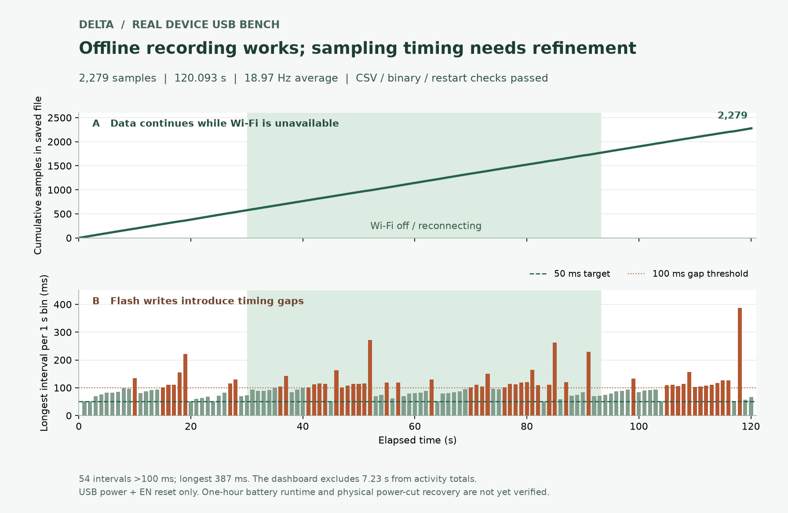

# Delta Rest & Activity Prototype

This repository contains the working files for Delta's rest/activity prototype,
including hardware, enclosure CAD, ESP32 firmware and experiment reports.

The current Stage 1B goal is to record IMU activity offline, review complete
sessions in a phone browser, and sync them automatically to a private website
after the board returns to home Wi-Fi. A harness-mounted walking monitor is being explored
because of the assembled enclosure's size; wearing/dog tests are deferred.

**Latest (2026-09-13):** The manual battery recording requirement passed. Session
`bfe0a2f2` saved 150,289 samples across 130 min 38 s, then reached the private
website with its binary integrity check passed. It exceeded the one-hour target,
but ended at the recorder's storage limit rather than through a manual stop; see
[the long recording result](experiments/battery_recorded_long_2026-09-13.md).
Website source is backed up in the private
[petring-site repository](https://github.com/CUJonZhao/petring-site).

**Resume here (2026-09-11):** [Today's report / 今日报告](docs/2026-09-11_daily_report.md) ·
[Home Wi-Fi auto sync / 回家自动同步](docs/2026-09-11_home_wifi_cloud_sync.md).
The board records by itself away from home Wi-Fi, closes the session after it reconnects,
uploads it to the private site, and frees space only from cloud-confirmed sessions.
**Validated on the board (2026-09-11):** the loop now runs unattended. A session
started from movement alone while still on home Wi-Fi, ended itself after five minutes
of stillness, uploaded, and appeared on the private site: 6,724 samples at 19.53 Hz.
Rest/walk is calibrated from a labelled indoor recording (149/149 windows agreed); the
run boundary is not. Open: a short real walk and wearing it on Delta's harness.

Previous (2026-09-09): [Today's report, photos and next steps / 今日报告](docs/2026-09-09_daily_report.md).
[Firmware handoff / 软件交接](docs/2026-09-09_offline_motion_logging.md).
The user has reported v0.4 printing and assembly complete. The offline recorder
has now been backed up/upgraded and tested on the board: a two-minute USB run
saved 2,279 samples through a Wi-Fi-off interval; CSV/binary comparison and
restart persistence passed. See the [physical report](experiments/offline_usb_bench_2026-09-09.md).
Average sampling was 18.97 Hz with flash-write timing gaps. The one-hour
battery supply and recorded-battery tests have passed; wearing/dog testing
remains pending.
Earlier mechanical details: [Stage 1B handoff](docs/2026-09-09_stage1b_handoff.md).

- [Current print package](hardware/enclosure/print_packages/delta_collar_v0_4_fit_print_20260909.zip)
- [Base/lid instructions](hardware/enclosure/v0_4/README.md)
- [Placement and cable-routing image](hardware/enclosure/v0_4/placement_routing.png)
- [Assembled prototype photo](hardware/reference_images/stage1b_v0_4_assembled_2026-09-09.jpg)

## Current Stage

Current status: Stage 1B home Wi-Fi auto-sync is implemented and passed a physical
bench end to end (record away, auto-close at home, upload, site confirmation).
The one-hour battery supply and recorded-battery validations have passed. A
real walk remains pending.

Stage 1A hardware bring-up is complete. The ESP32 Feather/HUZZAH32 V2,
LSM6DSOX IMU, LiPo battery path, Wi-Fi dashboard, enclosed USB bench test,
enclosed battery-only bench test, and four-minute hand-motion calibration have
all passed. The first dog-worn test is intentionally deferred because the
current enclosure is larger than desired for Delta.

Stage 1B focuses on:

- Reviewing the long battery recording's sampling gaps and capacity limit.
- Full-resolution data capture and automatic summary plots.
- Activity/rest threshold review from repeatable bench and hand-motion tests.
- Documenting the completed v0.4 enclosure and its remaining fit/retention details.
- Exploring a harness mount after the user resumes wearing tests.

As of 2026-09-06, a 3D printer has arrived and enclosure CAD work has
started. See
`docs/2026-09-06_stage1b_printer_arrival_and_enclosure_kickoff.md` and the
starting model in `hardware/enclosure/delta_collar_enclosure_v1.scad`.

As of 2026-09-08, the calipers have arrived and GitHub changes through
`7b54d0d` have been synced locally. Measured dimensions now feed a v0.3 low-wall
tray for powerless fit checks; see `hardware/enclosure/README.md`.
The first Feather, detached IMU, battery, and mounting-hole measurements are
recorded in `docs/2026-09-08_stage1b_caliper_measurements.md`. Hole-edge references
and the USB-inclusive length are confirmed, and mounting coordinates are derived.
Switch dimensions are recorded; the current preference is to mount it externally,
reserving cable exits and strain relief rather than internal switch space.
Underside and IMU slide-fit photos are archived. The user clarified that
19.59 mm measures the metal-pin gap, excluding the inward-projecting plastic
header bodies; the earlier usable-width estimate is withdrawn. The IMU can be
slid in from the side. The user confirms firm mechanical retention with no glue
or insulating layer, and an unchanged assembled height of 16.36 mm. Electrical
isolation and retention under motion remain to be verified; right-hand mounting
access was subsequently confirmed by the user on September 9.
A two-minute USB serial observation of this assembly then captured 2,370 samples
at 19.98 Hz with no firmware errors or post-startup resets. IMU temperature ranged
from 29.08 to 31.45 C. The user confirmed the battery was disconnected and reported
no physical anomalies during capture. See
`experiments/usb_slide_fit_2min_2026-09-08.md`; this is a short functional check,
not completion of enclosure, insulation, or wearability validation.

As of 2026-09-09, the user has printed the v0.3 tray and confirmed that the
board assembly and battery fit side by side with spare space. A removable
two-post cable guide (20 x 27 x 9 mm, shortened after the user's space check)
was designed for the long leads; see
`docs/2026-09-09_stage1b_tray_fit_and_cable_routing.md`. A v0.4 base and separate
lid now include four support posts, USB access, and a lay-in switch-wire exit.
The actual plug housing is 8.95 x 3.30 mm; the combined wire envelope is
3.32 x 1.59 mm, and the user confirms the IMU leaves the right holes accessible.
The battery plug's hard plastic projects 1.06 mm beyond the PCB edge, leaving
about 0.94 mm of nominal wall clearance; its raised wire bend needs a lid fit check.
See `hardware/enclosure/v0_4/README.md` for both STLs and fit instructions.
Mesh and nominal collision checks pass. The user subsequently confirmed printing
and assembly complete, with a [closed-case photo](hardware/reference_images/stage1b_v0_4_assembled_2026-09-09.jpg).
The final screw specification and internal retention details were not separately
confirmed; assembly completion does not certify wearing fit or waterproofing.

Stage 1 intentionally does not include medical diagnosis, production waterproofing, phone app deployment, GPS/LTE, or validated heart/respiration measurement.

## Next Work

Recommended next steps:

1. Take one supervised short real walk end to end: begin on battery, leave home
   Wi-Fi, return, and confirm automatic close and upload on the private site.
2. Review/download the real short recording in the phone-friendly `/records` page.
3. If fixed-rate behavior analysis is required, decouple sampling from synchronous
   flash writes and recheck interval distribution.
4. Use real recordings to refine activity reports. Do not advance wearing/dog
   testing until the user resumes that work.

## Repository Layout

- `docs/` - proposals, purchase/build notes, and PDF generation script.
- `firmware/` - ESP32 firmware (`imu_raw_stream` is the current recorder with home Wi-Fi sync).
- `hardware/` - wiring notes, enclosure sketches, hardware photos/diagrams, and enclosure CAD (OpenSCAD) starting point in `hardware/enclosure/`.
- `experiments/` - experiment plans and observation logs.
- `data/raw/` - raw CSV/log captures, ignored by Git except `.gitkeep`.
- `data/processed/` - processed analysis outputs, ignored by Git except `.gitkeep`.

## Key Documents

- `docs/canine_resting_vitals_smart_collar_proposal_v3_delta_first.md`
- `docs/canine_resting_vitals_smart_collar_proposal_v3_delta_first.pdf`
- `docs/stage1_purchase_and_build_notes.md`
- `docs/2026-08-12_stage1_handoff.md`
- `docs/2026-08-14_stage1_enclosure_bench_and_calibration.md`
- `docs/2026-09-06_stage1b_printer_arrival_and_enclosure_kickoff.md`
- `docs/2026-09-08_stage1b_caliper_measurements.md`
- `docs/2026-09-09_stage1b_tray_fit_and_cable_routing.md`
- `docs/2026-09-09_stage1b_handoff.md`
- [2026-09-11 daily report](docs/2026-09-11_daily_report.md)
- [Home Wi-Fi auto sync](docs/2026-09-11_home_wifi_cloud_sync.md)
- [2026-09-09 daily report](docs/2026-09-09_daily_report.md)
- [Offline recording handoff](docs/2026-09-09_offline_motion_logging.md)
- [Physical offline USB bench](experiments/offline_usb_bench_2026-09-09.md)
- `experiments/usb_slide_fit_2min_2026-09-08.md`
- `hardware/enclosure/README.md`

## Safety Note

This is an engineering prototype, not a veterinary diagnostic device. During early tests, Delta should be supervised, the battery should not be compressed or exposed, and charging should not be left unattended.
