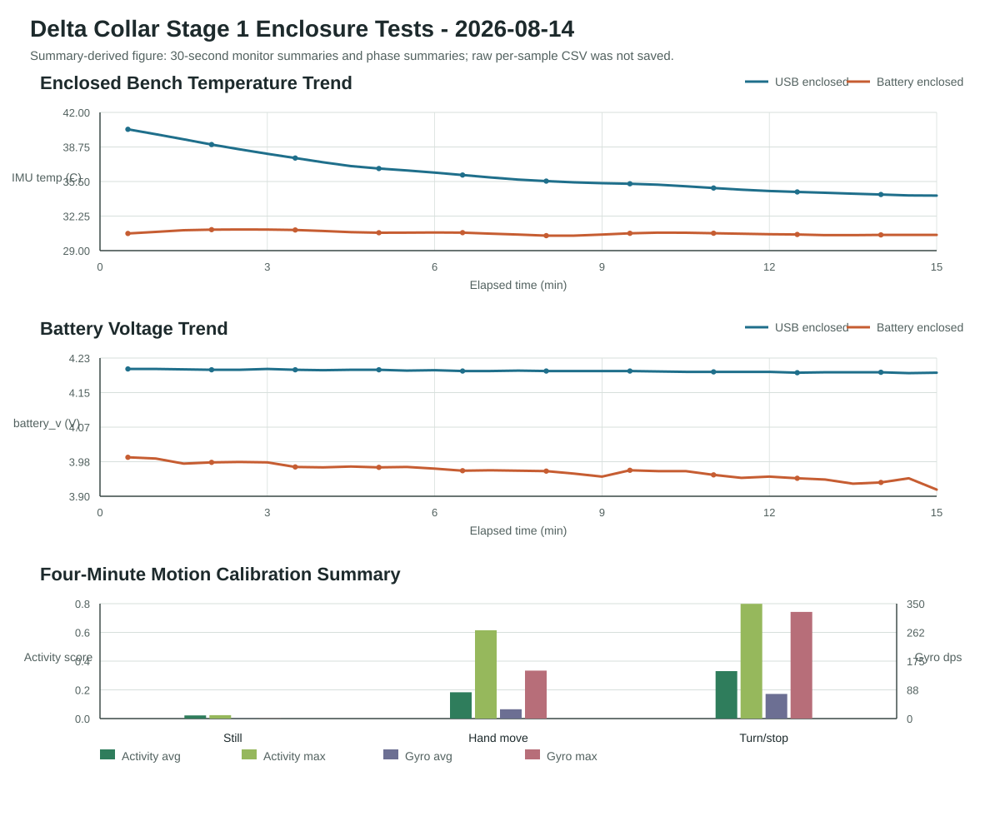

# Stage 1 Enclosure Bench And Calibration - 2026-08-14

This report records the first successful enclosed bench tests for the Delta
collar prototype. The larger ABS enclosure was dry-fitted, tested on USB,
tested on battery power, and then used for a short hand-motion calibration.

## Summary

| Check | Result |
|---|---|
| Powerless enclosure dry fit | PASS |
| Enclosed USB bench, 15 min | PASS |
| Enclosed battery-only bench, 15 min | PASS |
| Four-minute motion calibration | PASS |
| First dog-worn test | Deferred |

The electronics operated normally in the enclosure. No reset, data alert,
wireless dropout, odor, hot spot, LiPo swelling, LiPo dent, or wire pinch was
observed during the completed tests.

The first dog-worn test is intentionally deferred. The current enclosure is
functional for bench work but still feels too large for Delta. The next
mechanical step is a smaller 3D-printed enclosure before any on-dog test.

## Hardware Layout

Reference photo:

- `hardware/reference_images/stage1_enclosure_internal_wiring_2026-08-14.jpg`

Summary figure:

- `docs/figures/stage1_enclosure_bench_summary_2026-08-14.svg`

The summary figure was generated from 30-second monitor summaries and phase
summaries captured during testing. Raw per-sample CSV was not saved for this
session, so the figure should be treated as a trend summary rather than a
full-resolution data trace.

Observed layout:

- ESP32 Feather/HUZZAH32 V2 mounted in the larger enclosure with USB-C near the
  enclosure edge for bench access.
- Adafruit LSM6DSOX IMU fixed to the back side of the ESP32 board using
  double-sided tape.
- 3.7 V 500 mAh LiPo placed flat inside the enclosure.
- JST inline switch and battery leads routed around the enclosure edge.
- STEMMA QT cable routed with a gentle bend between ESP32 and IMU.

Safety checks before power:

- LiPo remained flat and removable.
- No forced lid closure was required.
- No visible battery compression, board-edge pressure, or wire pinch was
  observed after the powerless dry fit.
- The IMU-to-ESP32 tape layer was checked as an insulating/mechanical spacer.

## Enclosed USB Bench Test

Purpose: verify that the assembled enclosure can run from USB power without
rapid heat rise, resets, stream failures, or mechanical pressure symptoms.

Setup:

- USB-C connected.
- Battery switch kept OFF.
- Enclosure lightly closed, not used on Delta.
- ESP32 monitored through USB serial.

Result: PASS.

| Measurement | Result |
|---|---:|
| Duration | 901 s |
| Valid samples | 17,948 |
| Resets | 0 |
| Alerts | 0 |
| IMU temperature range | 34.11 to 40.64 C |
| End IMU temperature | about 34.18 C |
| Battery voltage trend while on USB | about 4.200 to 4.198 V |
| Motion magnitude range | 0.7666 to 1.3162 g |

Notes:

- After restart, the internal IMU temperature peaked near 40.64 C and then
  settled down to about 34.2 C by the end of the test.
- Static `motion_g` remained around 0.987 to 0.988 g. A few motion spikes were
  consistent with touching or moving the enclosure, not with a device fault.
- Physical post-check found no LiPo dent, swelling, odor, hot spot, or wire
  pinch.

## Enclosed Battery-Only Bench Test

Purpose: verify that the assembled enclosure can run from the LiPo without USB
power while streaming over Wi-Fi.

Setup:

- USB disconnected.
- Battery switch ON.
- Enclosure lightly closed, not used on Delta.
- ESP32 monitored through the dashboard API at `http://172.24.23.82/api/latest`.

Result: PASS.

| Measurement | Result |
|---|---:|
| Duration | 900 s |
| API samples | 1,791 |
| Network misses | 0 |
| Resets | 0 |
| Alerts | 0 |
| IMU temperature range | 30.33 to 31.04 C |
| Battery voltage trend | 3.994 to 3.916 V |
| Battery voltage range | 3.914 to 4.000 V |
| Motion magnitude range | 0.8653 to 1.0675 g |

Notes:

- Battery-only operation ran cooler than USB operation.
- Wi-Fi stayed connected for the full test window.
- Physical post-check again found no LiPo swelling, no dents, no odor, no hot
  spots, and no visible wire or connector issue.

## Four-Minute Motion Calibration

Purpose: confirm that the IMU remains mechanically coupled inside the enclosure
and that the current activity score separates stillness from hand motion.

Setup:

- USB disconnected.
- Battery switch ON.
- Dashboard API polled at roughly 4 Hz.
- Three phases:
  - 0:00-2:00 still on desk.
  - 2:00-3:00 gentle hand-held movement.
  - 3:00-4:00 gentle turns, starts, and stops.

Result: PASS.

| Phase | Samples | Motion magnitude | Activity score | Gyro magnitude | State counts |
|---|---:|---:|---:|---:|---|
| Still | 350 | 0.9879 to 0.9919 g | avg 0.0223, max 0.0240 | avg 0.44 dps, max 0.52 dps | Resting 350 |
| Hand movement | 188 | 0.6592 to 1.3201 g | avg 0.1829, max 0.6149 | avg 28.46 dps, max 146.01 dps | Active 93, Resting 95 |
| Turn/stop | 193 | 0.7263 to 1.3444 g | avg 0.3304, max 0.7988 | avg 75.02 dps, max 324.97 dps | Active 186, Resting 7 |

Overall connection result:

| Measurement | Result |
|---|---:|
| Duration | 240 s |
| Samples | 731 |
| Network misses | 1 |
| Resets | 0 |
| Alerts | 0 |
| End battery voltage | 3.904 V |

Conclusion:

- The still baseline was clean and consistently classified as Resting.
- Gentle motion and turning produced clearly higher activity scores.
- The IMU mount was stable enough for continued bench calibration.

## Current Decision

The current enclosure is acceptable for bench tests but is larger than desired
for a first dog-worn trial. The dog-worn collar test is deferred until a smaller
3D-printed enclosure is designed and built.

This decision does not block continued Stage 1 engineering work. It only delays
comfort validation and real dog-worn motion data collection.

## Recommended Stage 1B Work

Proceed with bench and design work before any on-dog test:

1. Run a longer battery-only runtime test, starting with 1 hour.
2. Add test labels or session metadata to dashboard CSV exports.
3. Build a small analysis script for battery trend, motion score, and state
   summary.
4. Measure the exact dimensions of the Feather, LiPo, IMU, JST switch, cable
   bends, and required lid clearance.
5. Draft a smaller 3D-printable enclosure concept with:
   - Flat, non-compressed LiPo placement.
   - Removable battery access.
   - Strain relief for JST and STEMMA QT cables.
   - External access to the power switch.
   - Dog-facing foam contact surface.
   - No hard strap head or screw feature on the dog-facing side.
6. Keep dog-worn testing blocked until the smaller enclosure passes the same
   dry fit, USB enclosed, battery enclosed, and motion calibration sequence.

## Safety Status

This remains an engineering prototype, not a veterinary diagnostic device.
Charging should only be done attended, through the Feather's onboard charger,
with the enclosure open and the battery not compressed. Do not charge while
worn or while the enclosure is closed.
