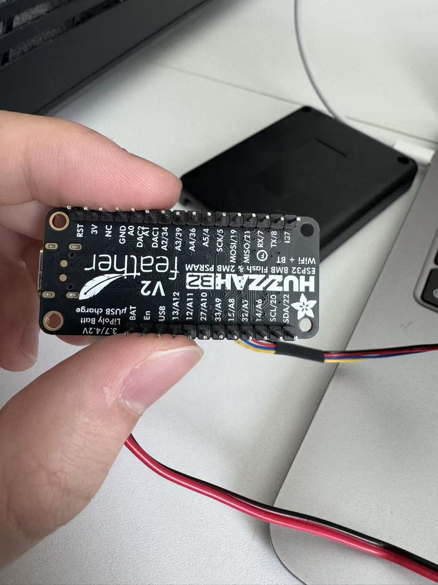
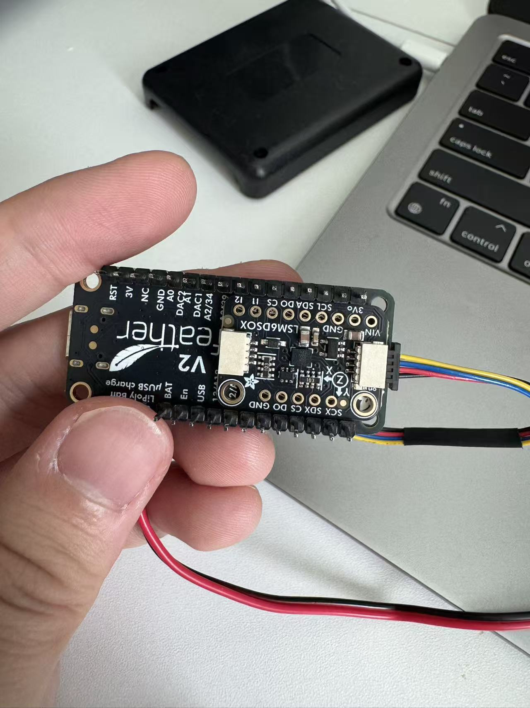
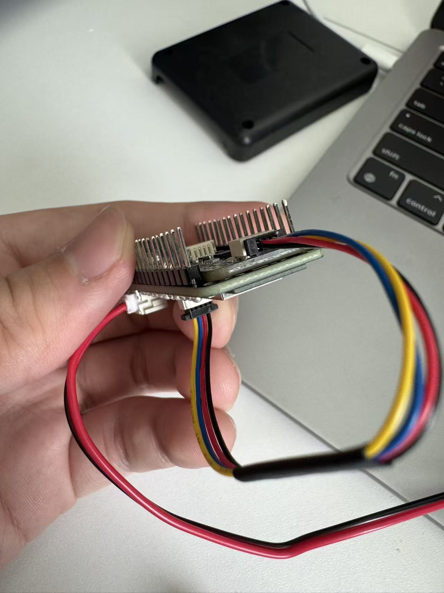

# Stage 1B：卡尺到货与实物测量 — 2026-09-08

## 本次进度

- 已从 GitHub fast-forward 同步 `main`：`457c923` → `7b54d0d`。
- 同步了 9 月 6 日进度记录、OpenSCAD 参数模型和三个 STL 文件。
- 用户确认游标卡尺已到货，并提供第一轮实测尺寸，记录如下。
- IMU 曾取下单独测量，现已由用户从侧面滑入 Feather 背面排针座之间。用户确认当前为无胶、无绝缘垫层的机械卡持，手感非常牢固；组合总高仍为原先的 16.36 mm。此状态的电气隔离及运动下的固定可靠性尚未验证。
- 已收到开关尺寸。用户倾向将开关外置，当前外壳规划不为开关本体预留内部空间；外置固定方式尚待确定。
- 当前为 Stage 1B 外壳小型化。现有大外壳已通过断电试装、15 分钟 USB、15 分钟电池及 4 分钟手持动作测试。
- 已完成当前无胶机械卡持装配的两分钟 USB 串口观测，保存 2,370 条样本，未发现固件错误或启动后的再次复位；见下方测试结果链接。小外壳配合、1 小时电池测试和该长测的完整数据采集仍待完成。

最新状态汇总见 [9 月 9 日工作交接](2026-09-09_stage1b_handoff.md)。本文同时保留测量与装配判断的修正过程。

## 测量方法（后续补测时使用）

拔掉 USB，关闭开关并断开电池。卡尺擦净、闭合归零，统一使用 mm。
不要为测量强拆当前卡持的 IMU；优先测整个组件的外包络。
金属量爪不要碰电池插头的两个触点，不要夹压电池软包；电池厚度仅轻触估读。
每项重复测量两次；记录读数，不要先把设计余量加到实测值里。

| 项目 | 实测值（mm，空白为待测） | 测量说明 |
|---|---|---|
| Feather PCB 长 × 宽；整板总高（含焊接公插，不含 IMU） | 51.57 × 22.80；16.36 | 总高不是 PCB 板厚；51.57 不含 USB 突出部分 |
| Feather 含 USB 金属接口总长 | 52.05 | 比 PCB 长 0.48 mm；不含外接 USB 线插头及插拔空间 |
| Feather PCB 板厚 | | 板厚只量板材，避开器件和焊点 |
| Feather 上侧排针突出高度 | 1.18 | 用户报告的上侧，保留原始方向定义 |
| Feather 下侧排针／焊脚突出高度 | 9.10 | 用户报告的下侧，保留原始方向定义 |
| IMU 长 × 宽 × 高（单独测量） | 25.51 × 17.82 × 4.71 | 已侧向滑入排针塑料座之间；用户明确无胶、无绝缘垫层 |
| Feather + IMU 当前组合总高 | 16.36 | 用户确认与原 Feather 含排针高度一致，IMU 未超过原高度包络；不再额外加 4.71 mm |
| 当前组合含连接器、走线的总长 × 总宽 | | 线材出口包络尚未给出；不能把 PCB 尺寸等同于插线后的总包络 |
| 四个安装孔直径 | 左侧有金属圈两孔：2.45；右侧无金属圈两孔：2.52 | 以用户照片为准：USB 在左，元件面朝向镜头 |
| 四孔中心位置 | 见下方推算坐标 | 根据已确认的孔内缘到板边距离推算，尚未经打印试装验证 |
| 安装孔下方可用空间 | 9 月 9 日用户确认右侧两孔下方能放支撑柱，IMU 无遮挡 | 更新先前仅凭照片的可能遮挡判断；柱径和四孔对位仍需 v0.4 实物试装 |
| 背面两排金属针内侧距离 | 19.59 | 用户更正：只量了金属针之间，未包含向内占用空间的黑色塑料座；不是有效安装净宽 |
| 背面两排黑色塑料座间净宽 | | 尚无实测数值；不能用 19.59 mm 代替 |
| LiPo 长 × 宽 × 厚 | 35.90 × 32.25 × 4.80 | 宽度包含贴在长边的一段电线，作为当前布局外包络保留 |
| JST 开关长 × 宽 × 高 | 45.05 × 15.89 × 15.19 | 高度包含 OFF 状态按钮；当前按外置规划，不计入盒内组件包络；ON 状态及完整操作空间未测 |
| USB 线插头外壳宽 × 高 | 8.95 × 3.30 | 9 月 9 日补测；实际外壳为金属 |
| Feather 白色电池插头超出 PCB 长边 | 1.06 | 硬塑料部分，不含软线；软线回弯高度待试放 |
| 开关线束合计自然宽 × 厚 | 3.32 × 1.59 | 全部出盒线材仍需一起试放槽口 |
| STEMMA 接头／软线弯曲包络 | | 精确形状与绕线高度未量，按现有插接状态试放 |
| 项圈宽 × 厚、固定带宽 × 厚 | | 用于后续绑带槽设计 |

孔中心不方便直接量时，可量 PCB 边缘到孔近边的距离，再加半个孔径。
同径两孔的中心距也可用外侧总距减一个孔径；不要把孔边距当成中心距。
线材保持自然弯曲，只记录布局所需空间，不要折线寻找极限弯曲半径。

第一轮组件、排针、孔位与电池测量已完成。后续若补测孔位，可附标明 USB 方向和孔编号的俯视照片，减少坐标歧义。

## 安装孔原始读数与推算位置

用户照片中 USB 位于左侧，左边两孔有金属圈，右边两孔无金属圈。
用户已确认以下距离从孔内缘量到板边，不从金属圈外缘或孔中心起量：

| 孔组 | 到宽边（短边）的距离 | 到长边的距离 |
|---|---:|---:|
| 左侧有金属圈两孔 | 1.63 mm | 1.34 mm |
| 右侧无金属圈两孔 | 1.42 mm | 1.34 mm |

孔中心间距是两个圆孔圆心之间的距离，用于定位外壳固定柱。
根据已确认的孔内缘到板边距离和 PCB 长度 51.57 mm，推算如下：

- 左孔中心距左短边：1.63 + 2.45 / 2 = 2.855 mm。
- 右孔中心距右短边：1.42 + 2.52 / 2 = 2.680 mm。
- 左右孔沿板长方向中心距：51.57 - 2.855 - 2.680 = 46.035 mm。
- 左侧上下孔中心距：22.80 - 2 × (1.34 + 2.45 / 2) = 17.67 mm。
- 右侧上下孔中心距：22.80 - 2 × (1.34 + 2.52 / 2) = 17.60 mm。

以照片中 PCB 左短边为 x=0、上长边为 y=0，x 向右、y 向下（不以 USB 接口外缘为原点）：

| 孔 | 推算中心 (x, y)，mm |
|---|---|
| 左上，有金属圈 | (2.855, 2.565) |
| 左下，有金属圈 | (2.855, 20.235) |
| 右上，无金属圈 | (48.890, 2.600) |
| 右下，无金属圈 | (48.890, 20.200) |

这些是按用户每组两孔共用读数推算的坐标，额外小数位来自运算，不代表测量精度。
小差异可能来自测量误差，不据此认定孔位不对称；后续需试装验证。
按实测占地设计的 v0.3 低侧壁托盘已通过用户实物并排试放；上述孔坐标已用于 v0.4 四柱模型，实物对孔待验证。
已收到侧向滑入照片和 19.59 mm 测量起点更正。用户确认无绝缘层、组合总高仍为 16.36 mm；安装孔支撑通道后来已确认，板间电气接触与运动保持仍待实际核对。

## 背面照片检查

来源：用户于本次测量对话提供的背面照片，已保存在仓库内。
上面的孔位坐标仍采用此前正面照片的方向，不能直接用背面照片的上下方向替换。

- 四个角孔均可见；可继续以四孔支撑为设计候选，但照片不能验证柱体与相邻排针的间隙。
- 两条长边各有一排排针／塑料座，中部没有明显的大器件，仍可见焊盘等导电部位。
- 照片不提供可靠的净宽或垂直间隙数值，不据此认定 IMU 能嵌入排针之间。
- 用户最初报告 19.59 mm，随后澄清这只是金属针之间的距离，忽略了黑色塑料座。此前据此推算的总余量 1.77 mm／每侧约 0.89 mm 不适用于实际安装净宽，已撤回。
- 后续用户已确认 IMU 嵌入后仍在原排针高度包络内，组合总高沿用 16.36 mm；当前无需重复索取同一高度。只有改变隔离层或安装结构后，才需要复核是否超出这一包络。

### 后续实际试放与修正

用户报告：从上方直接贴合时放不下，从侧面推入后能刚好卡在黑色塑料座之间，侧面与背部贴合紧密。进一步确认未使用任何胶、胶带、双面胶或绝缘垫层，完全依靠机械卡持，手感非常牢固；IMU 嵌入针脚之间未增加高度，总高仍为 16.36 mm。此处记录用户装配观察，不是运动可靠性或通电检查通过。

- 照片显示 IMU 位于 Feather 背面靠右的位置，连接线向右伸出；高度按用户确认值记录，线材弯曲包络尚未提供，不按照片比例推算。
- 更正此前照片解读：侧视图的层状外观不能认定为额外垫层；用户已明确没有添加材料。Feather 背面照片可见裸露焊盘，紧密贴合本身不能证明两板导电部位已隔离；确认隔离前保持 USB 和电池断开。
- 不要求必须用胶固定；机械固定方案仍可继续评估。但“卡得很牢”只说明当前手感，尚未证明运动时的保持力或板上受力合适。如果装入需要撑开排针座、压弯板子或刮擦焊点，则调整布局，不继续强推。
- 背面俯视图中 IMU 靠近并可能遮挡 Feather 右下安装孔区域；IMU 自己的孔不视为与 Feather 孔同轴。四孔支撑仍需逐孔确认通道。

板间电气隔离可以通过可靠固定的间隔材料，或使裸露导电部位保持间隙的独立支撑实现，不强制增加专用绝缘膜或新采购。不要把额外材料强塞进现有紧配合。当前 16.36 mm 是组件高度基准，不是盒内净高，完整外壳仍需底部与顶部装配间隙。当前 v0.3 仅用于断电占地试装，支撑设计仍需避开右侧孔区的潜在干涉。

### 现有双面胶与下一步选择

用户说明手头只有采购清单中的双面胶，没有另购绝缘材料。采购记录为“3M 1/2 inch foam double-sided mounting tape”，未记具体产品型号和厚度。8 月 14 日旧组装记录也曾使用双面胶作为板间机械隔垫，但这不是当前胶带型号电气性能的认证。

- 不要求一定有单独的绝缘层；需要保证两板可能相碰的裸露导电部位不会接触，可靠的支撑间隙也是一种办法。
- 现有泡棉双面胶可作为间隔与固定候选，但不要求为加胶强行拆开当前卡持结构；不要仅凭品牌认定胶带的绝缘等级。
- 若采用胶层，应避开尖锐焊脚，确保胶层不会被刺穿或挤到两板金属相碰，留出安装孔和插头位置。不要求涂满两块板，但需要实际检查全部可能接触的导电部位。
- 当前侧向卡位较紧，若加入泡棉胶后无法自然放入，就改支撑布局；不要为了保持 16.36 mm 而强行挤压。重新布置后只有超出原包络时才修订高度。

参考：[Adafruit LCD Backpack 组装说明](https://learn.adafruit.com/i2c-spi-lcd-backpack/assembly)在其板间接触场景中建议用电工胶带或泡棉胶带避免元件短接。这支持泡棉隔垫的原型装配思路，不证明本项目这卷未识别型号的胶带具有特定绝缘额定值。

### 最新决定：保留当前卡持，先验证再定布局

用户说明当前卡得很紧，取出困难，希望先测试再决定布局。保留该偏好：不要求为加入双面胶强拔 IMU，也不强行塞入胶层。

- 当前可继续断电机械试装：确认整体是否平直、四孔支撑位置、底部和盖子间隙、接头及外置开关走线；16.36 mm 继续作为当前组件高度。
- 通电与否取决于是否排除了板间意外导电接触，不取决于是否用了胶。侧面照明检查时需看清相对的焊盘、焊脚、金属孔圈与针脚；照片尚不足以确认隐藏接触面的情况。
- 若接触区可检查且确认不存在金属误接触、针脚受挤弯等问题，可以开始短时、有人看护的开放式 USB 台架测试，电池保持物理断开；先静置观察数据、异常复位及发热，再决定后续动作测试。USB 供电也不是短路保护的保证。
- 若关键接触区无法看清，则暂不直接以插电池或 USB 的方式试错；继续断电布局验证，另行安排断电电气检查或可控的拆装。普通“能启动／有数据”不能证明无意外接触或长期机械可靠性。
- 上述路径制定时尚未执行测试；随后用户发起 USB 测试，结果记录如下。

### 已完成：两分钟 USB 串口观测

详见 [测试报告](../experiments/usb_slide_fit_2min_2026-09-08.md)。用户在测试中确认电池已断开，未发现异常发热、异味或板子明显弯曲。采集得到 2,370 条有效样本，约 19.98 Hz；启动后无时间戳回退，无固件错误。IMU 内部温度范围 29.08–31.45°C，末段静止加速度模长 0.9918–0.9969 g。

本次仅证明该窗口内基本功能正常；板间绝缘、机械固定耐久性及完整外壳验证仍未完成。当前无需为补胶强拆，但不能把此次功能结果当作这些项目已通过。

## 开关外置设计方向

按用户当前偏好，盒内不容纳开关本体，不为按钮设计盒壁操作开口。
仍需为开关连接线进出盒体预留通道，并设计出口护边及线材应力释放。
外置开关需要独立固定，避免悬挂拉扯连接器；固定位置和方式待布局时确定。
记录的 15.19 mm 仅为 OFF 状态外包络，不代表完整按钮操作包络。

## 收到尺寸后的工作

1. 将真实外包络与当前 CAD 参数对应，避免板高、排针和 IMU 高度重复相加。
2. 根据孔位和下方空间设计支撑，检查电池平放、走线及外置开关线材出口。
3. 更新模型后导出新的底盒／盖子，先做断电试装与盖子配合检查。
4. 配合确认后完成固定、外置开关固定、线材出口与应力释放和项圈固定结构，再重复原有台架验证顺序；通过前不进行 Delta 佩戴测试。

注意：旧记录把 7.2 mm 和 4.6 mm 写成“bare-PCB thickness”，不可直接当作板材厚度使用。旧 v0.1／v1／v1_1 STL 未按本次实测修订；新生成的 v0.3 试装托盘采用了本次实测占地。

## 已准备：v0.3 低侧壁试装托盘

文件与操作见 [外壳目录说明](../hardware/enclosure/README.md)。托盘外尺寸 65.25 × 65.25 × 11.60 mm，内部平面 62.05 × 62.05 mm、侧壁内高 10 mm；板组与电池旁置，开关外置。此版用于检查占地、线材和柱位通道，不是完整高度的最终外壳。

STL 网格与尺寸核对通过，尚未做 Bambu 切片或实物打印。下一步导入 STL、切片打印并断电试装，反馈俯视／侧面照片及干涉位置。

后续更新（2026-09-09）：用户已完成打印并确认可以并排放下，仍有空余空间，提出增加绕线柱。新的试装照片、双柱理线座及下一步操作见 [9 月 9 日记录](2026-09-09_stage1b_tray_fit_and_cable_routing.md)。

再次补测（2026-09-09）：用户确认当前 IMU 不遮挡 Feather 右侧两个安装孔，下方可放柱子；这更新了前文仅凭照片所作的潜在遮挡判断。实际 USB 线插头金属外壳为 8.95 × 3.30 mm，通往外置开关的线束合计自然宽 × 厚为 3.32 × 1.59 mm。已将这些值用于 [v0.4 带盖试装版](../hardware/enclosure/v0_4/README.md)，实物柱位和合盖尚待检查。
