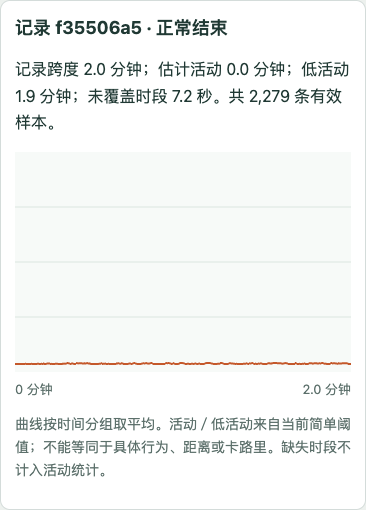
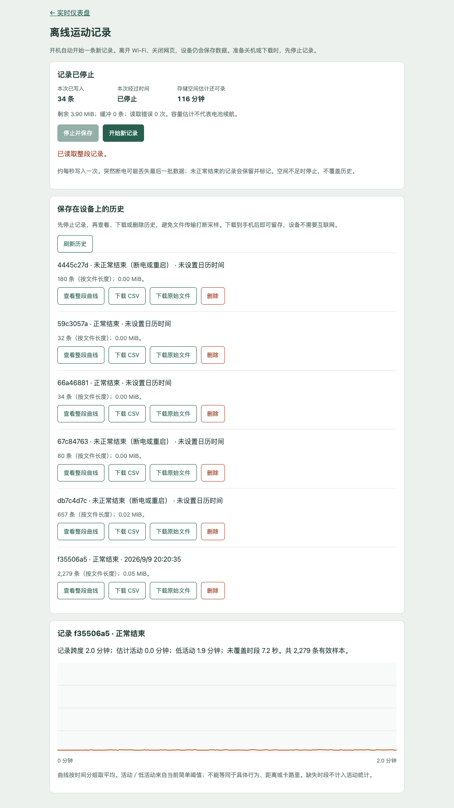

# Delta 项目日报与续接指南 — 2026-09-09

今天完成了 **v0.4 实物组装、离线运动记录固件、手机网页历史查看，以及第一次断开 Wi-Fi 的实机短测**。
设备现在能将运动样本保存在板载闪存，恢复网络后下载完整记录。
本日以软件、装配和桌面验证收尾，暂不推进佩戴或上狗测试。

## 当前成果

| 事项 | 今日结果 | 证据／入口 |
|---|---|---|
| 外壳 | 用户确认 v0.4 打印、组装完成；照片可见合盖、交叉魔术贴和外置开关 | [组装照片](../hardware/reference_images/stage1b_v0_4_assembled_2026-09-09.jpg)、[结构与打印文件](../hardware/enclosure/v0_4/README.md) |
| 产品方向 | 因当前体积，探索胸背式遛狗活动记录；优先解决记录和回看 | 本报告及 [开发交接](2026-09-09_offline_motion_logging.md) |
| 离线记录 | 开机自动创建新记录；20 Hz 目标采样，批量写入独立 4 MiB 闪存区 | [固件说明](../firmware/imu_raw_stream/README.md) |
| 手机查看 | 浏览器可停止／开始、列出历史、查看整段曲线、下载 CSV／原始文件 | [真实手机页面](figures/offline_report_mobile_2026-09-09.png) |
| 升级与保留 | 完整备份 8 MB 闪存后升级；原有 560 条电池日志逐行保留 | [升级与实机报告](../experiments/offline_usb_bench_2026-09-09.md) |
| 两分钟实机 | 2,279 条样本，关闭 Wi-Fi 后仍增长，CSV 与二进制一致，重启后旧文件不变 | 主记录 `f35506a5` |

## 组装状态

这是用户提供的实物照片。当前外壳沿用已发布的 v0.4 CAD：底盒约 65.25 × 65.25 × 21.36 mm，合盖名义外尺寸约 69.05 × 69.05 × 22.96 mm。
照片确认了整体装配外观；实际螺钉规格、电池内部固定方式、保持力、防水和佩戴舒适性没有在本轮单独验证。
IMU 保持既有背面机械卡持，组合总高仍采用用户确认的 16.36 mm；没有为本次工作强行拆出。

已有文件继续复用：[完整打印包](../hardware/enclosure/print_packages/delta_collar_v0_4_fit_print_20260909.zip)、[摆放与绕线图](../hardware/enclosure/v0_4/placement_routing.png)、[测量记录](2026-09-08_stage1b_caliper_measurements.md)。本轮没有改动 STL。

## 数据链路已补齐到哪里

记录阶段不要求家庭 Wi-Fi、手机持续连接或互联网。回看时可使用设备热点，或让手机与设备处于同一家庭局域网。
这里的网页由设备提供，**云端网站上传、专用手机 App 和蓝牙同步尚未实现**。

- 每条 24 字节，保留原始六轴计数、相对时间、IMU 温度、电压及简单活动分数／状态；文件头 32 字节，每条带 CRC。
- 按 20 Hz 计算，一小时约 1,728,032 字节，另计文件系统开销。容量足以作为一小时记录方案的基础，但还不是续航实测结果。
- 正常停止会保存剩余缓冲。未正常结束的文件保留并标记；空间不足停止，不自动覆盖历史。
- 大文件下载在停止记录后进行；CSV 导出校验数据，手机页面再次核对行数，避免把截断下载当成完整文件。
- 自动开机记录只有相对时间；从手机按“开始新记录”时，会附带手机当前日历时间。没有伪造离线时钟。

## 真实设备页面

这张图来自真实板子的主测试记录，非合成演示数据。设备处于桌面，曲线低活动符合本次场景；它不能用于确认走路、跑步或犬类行为分类效果。

列表中有几条启动、串口连接和复位产生的短记录；`interrupted` 表示没有正常按停止结束，不等同于全部数据损坏。
本次主要两分钟记录是 **`f35506a5`**；专门用于复位恢复的记录是 **`67c84763`**。

## 实测数据与限制

图上半部按下载文件中的样本时间戳重建累计样本数；绿色区间从关闭无线命令到确认重连，包含重连过程，事件时刻与样本时刻可能有请求延迟量级的偏差。
下半部展示每秒内最大的相邻采样间隔。它显示了一个需要后续改进的限制：**同步闪存写入会阻塞采样，当前并非严格恒定的 20 Hz**。

| 检查 | 实测 |
|---|---|
| 记录跨度／样本数 | 120.093 秒／2,279 条 |
| 平均频率／间隔中位数 | 18.973 Hz／50 ms |
| 最大间隔 | 387 ms |
| 大于 100 ms 的间隔 | 54 段，合计 7.202 秒 |
| 网页未覆盖时间 | 约 7.2 秒，包含初始 30 ms；不计作活动或静止 |
| 关闭无线期间 | 写入计数从 560 增至 1,140；HTTP 不可达时串口仍确认正在记录 |
| CSV 与原始数据 | 行数一致，时间戳／状态／数值逐条核对通过 |
| 正常记录重启保持 | 重新下载后逐字节相同 |
| 未停止记录的 EN 复位 | 80 条已同步样本恢复，状态为未正常结束 |
| 固件错误 | 测试未发现 `ERROR`，读取错误计数为 0 |

原始文件 54,728 字节。详细方法、哈希、温度范围、备份和串口速度见 [实机报告](../experiments/offline_usb_bench_2026-09-09.md)。
**USB 短测不等同于一小时电池续航，EN 复位也不等同于切断供电。** 实际写满停止、直接断电尾部恢复仍待验证。

## 今天归档的文件

| 类别 | 文件 |
|---|---|
| 固件与分区 | [main.cpp](../firmware/imu_raw_stream/src/main.cpp)、[记录器](../firmware/imu_raw_stream/src/motion_logger.cpp)、[数据格式](../firmware/imu_raw_stream/src/motion_format.h)、[分区表](../firmware/imu_raw_stream/partitions.csv) |
| 手机页面 | [records_page.h](../firmware/imu_raw_stream/src/records_page.h) |
| 解码与实机验证 | [独立解码工具](../experiments/decode_motion_log.py)、[USB 验证脚本](../experiments/validate_offline_recorder.py) |
| 自动化检查 | [主机测试](../firmware/imu_raw_stream/tests/test_offline_log.py)、[浏览器测试](../firmware/imu_raw_stream/tests/records_page_test.cjs) |
| 数据图复现 | [汇总 JSON](../experiments/results/offline_usb_bench_2026-09-09_summary.json)、[绘图脚本](../experiments/plot_offline_bench.py)、[SVG](figures/offline_usb_bench_2026-09-09.svg) |
| 开发环境与操作 | [固件说明](../firmware/imu_raw_stream/README.md)、[实验依赖](../experiments/requirements.txt) |

图可直接从已提交的汇总 JSON 重新生成：安装 `experiments/requirements.txt` 后，在仓库根目录运行 `python experiments/plot_offline_bench.py`。
汇总数据使用真实短测结果；主机测试中的 72,000 条合成样本只用于格式／下载流程验证，没有混入实测图。

整片闪存备份、含设备设置的文件、原始串口日志与完整 CSV/BIN 留在本地 `data/raw/offline_upgrade_20260909_201050/`，由 `.gitignore` 排除。
GitHub 收录代码、报告、实物／界面图片和可复现的汇总数据。新克隆能看报告与重画图，但不会自动得到设备原始备份。

## 下次从这里继续

1. 测试结束时设备已停止记录、无线已恢复；重新开机会自动开始新记录。需要回看时进入设备 `/records`；局域网地址可能随网络变化。
2. 下一项验证是一小时桌面电池记录，检查完整文件、采样间隙、实际存储占用和电压趋势。
3. 如要做更严格的固定频率分析，先解耦采样与闪存写入，再比较间隔分布；本次没有为了报告修改已验证的采样实现。
4. 单独验证直接断电、存储写满和离开家庭网络时的热点自动恢复。
5. 用户明确暂缓佩戴和上狗；后续行为标签采集、算法改进和胸背固定方案，在用户恢复该方向后继续。
