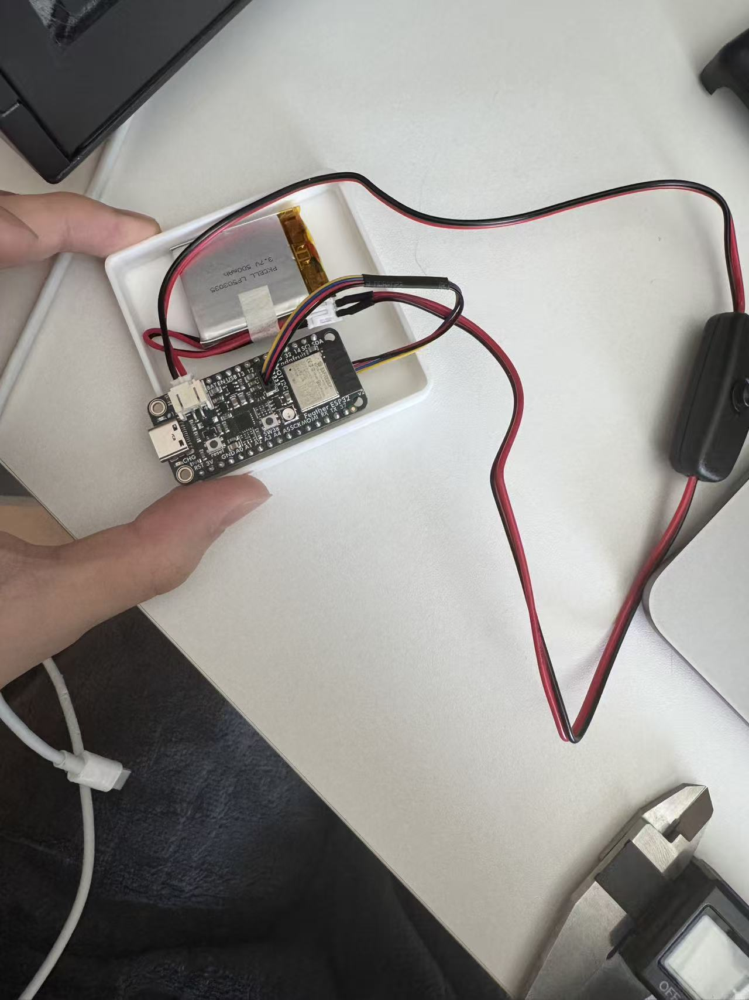

# Stage 1B：托盘实物试装与理线需求 — 2026-09-09

后续状态：用户已确认 v0.4 打印和组装完成，离线记录固件已刷入并通过 USB 短测。见 [日终报告与图片](2026-09-09_daily_report.md)；下文保留此前试装和设计过程。

## 已确认的进展

用户已打印 v0.3 试装托盘，并确认 Feather＋IMU 组合与电池可以并排放下，仍有空余空间。
这确认了初步平面布局；固定柱位置、带盖后的高度和完整装配还未验证。

照片中开关保持外置。红黑开关线较长，四色 IMU 线也有一段余量；用户提出加入绕线柱。
本次没有新增通电测试，也未从照片推算新的精确尺寸。

## 已准备的改动：双柱理线座

当前文件：[delta_collar_v0_3_cable_guide_27mm.stl](../hardware/enclosure/delta_collar_v0_3_cable_guide_27mm.stl)。

用户随后实测可用长边约 30 mm，要求尽量做成 27 mm。已将原 32 mm 版本修订为 27 mm，并同步调整柱径和柱距；当前以文件名带 `27mm` 的版本为准。

这是可追加到已有托盘的小配件，用来先验证理线位置，后续可把结构合并进完整底盒。
已打印托盘的外尺寸继续保留为 65.25 × 65.25 mm。

| 项目 | 设计尺寸 |
|---|---:|
| 理线座整体尺寸（X × Y × Z） | 20 × 27 × 9 mm |
| 平底厚度 | 1.2 mm |
| 两柱中心距 | 14 mm |
| 柱身直径 | 10 mm |
| 顶部挡边直径 | 12 mm |
| 两挡边之间净距 | 2 mm |
| 柱身可绕线高度 | 6 mm |

上述是本轮设计初值，不是电线厂商给出的最小弯曲半径或已验证收线容量。
9 mm 总高不包含双面胶厚度和电线绕好后的外包络。
圆柱顶部采用斜面挡边和倒角，底板四角为圆角。

图中的建议位置是原模型电池旁的空位。按既定摆放坐标，理线座底板距离电池占地约 2.5 mm，距离板组占地约 1.6 mm；这些是模型计算间隙，实际线材尚需试放确认。不要把理线座或绕出的线压在电池上。

## 现在如何使用

1. 在 Bambu Studio 用文件名带 `27mm` 的 STL 替换旧理线座，缩放保持 100%，确认尺寸为 20 × 27 × 9 mm。不要对旧 32 mm 版整体等比例缩放，以免同时缩小高度与壁厚。平底朝下、两柱朝上，沿用已有材料配置；先切片检查，再自行打印。模型的挡边下方是 45° 斜面，未替用户执行切片或打印。
2. 冷却并清理毛刺后，先断电放入托盘中的空位，不急着粘。
3. 让盒内余线围绕两柱外侧形成松的椭圆圈，不在两柱中间的窄缝里挤线，不把线绷紧。接头附近保留自然弯曲与插拔松量；遇到明显回弹或需要压线才能放下时，调整布局。
4. 理线合适后，用已有泡棉双面胶贴在理线座底面，固定到托盘底部。此胶用于理线座，不要求拆开已经卡住的 IMU。
5. 外置开关那一侧过长的线段可以留在盒外，后续用已有魔术贴固定在项圈／模块外侧。理线柱整理盒内余线，不能代替外部线材出口的防拉扯固定，也不保证能收纳全部开关线。
6. 线材摆好后提供俯视和侧面照片，检查电池可取出、插头不受拉、余线没有高过计划的盖内空间，再确定完整底盒、固定柱、出线口及盖子。

## 文件核对与后续范围

- STL 由实体布尔运算生成，并重新读入检查：单个实体，1,552 个三角面，表面闭合、面朝向一致、无退化三角面、外尺寸符合预期。
- 已查看由实际导出 STL 渲染的模型预览。尚未完成切片和实物验证。
- [可编辑 SCAD](../hardware/enclosure/delta_collar_v0_3_cable_guide_27mm.scad)、[生成脚本](../hardware/enclosure/generate_v0_3_cable_guide.py)、[核对结果](../hardware/enclosure/delta_collar_v0_3_cable_guide_27mm_validation.json)均已保存。原不带 `27mm` 后缀的 32 mm 文件仅作历史记录。
- 此配件不替代完整外壳版本；后续已设计 v0.4 底盒及盖子，见下文。绕好线的实际高度仍待试放。

## 后续补测与 v0.4 带盖底盒

用户在理线座打印期间要求继续添加充电口、开关出线口及 Feather 固定桩。随后补充：

| 项目 | 用户确认值 |
|---|---|
| USB 线插头外壳宽 × 高 | 8.95 × 3.30 mm，外壳为金属 |
| Feather 右侧两个孔下方 | 能放支撑柱，IMU 无遮挡 |
| 开关线合计自然宽 × 厚 | 3.32 × 1.59 mm |
| Feather 白色电池插头硬塑料超出 PCB 长边 | 1.06 mm，不含软线 |

“高度和外壳一致”的最初描述已由明确的 3.30 mm 替代。保持当前 IMU 卡持状态，组合高度仍是 16.36 mm。

已生成 [v0.4 底盒与独立盖子](../hardware/enclosure/v0_4/README.md)：

- 底盒沿用 65.25 × 65.25 mm 外部平面，升高到 21.36 mm；底厚 2 mm，壁厚 1.6 mm。
- 四柱顶距内底面 10.1 mm，排针离底设计间隙 1 mm。柱内为 M2 试配导孔，需要合适螺钉才能锁固；采购清单尚未确认 M2 螺钉。
- USB 侧开口净宽 10.15 mm；开关侧线槽宽 4.52 mm，合盖后最大高度 3.39 mm，底角为圆角。线可以开盖放入，盖上的挡片负责限位。
- 外套盖裙单侧间隙 0.3 mm；装配后整体 69.05 × 69.05 × 22.96 mm。此配合尚未实物验证。
- 27 mm 理线座继续作为独立可复用配件，给已有打印预留位置。双面胶和绕线后的额外高度不包含在理线座模型中。

底盒/盖子 STL 重新读入验证通过：分别为单个闭合实体、朝向一致、尺寸正确；名义合盖状态无实体碰撞，USB 与线束开口保持贯通。已查看实际网格渲染图。尚未切片、打印或确认实际孔位与盖子公差。下一步按 v0.4 说明进行断电试装和固定件试配。

随后按用户要求准备了 [俯视摆放与绕线图](../hardware/enclosure/v0_4/placement_routing.png)。绘图时补核电池插头，用户测得硬塑料超出板边 1.06 mm；原板边净空 2 mm，硬塑料名义余量 0.94 mm，因此软线安排向上回弯、另核合盖高度，不把窄缝作为走线槽。未修改底盒和盖子几何。

图中保留当前 IMU 背面卡持，IMU 线留松弯；长电源线沿两柱外侧整理，开关外部余线用现有魔术贴收拢。零件平面占地按参数绘制，接头与软线曲线仅为方案示意，线长、绕线圈数和弯曲高度仍待实际试放。
