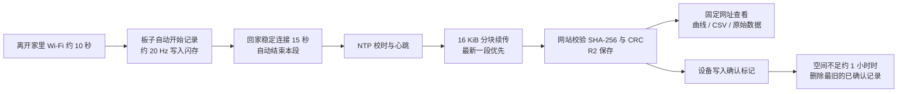

# Delta 项目日报与续接指南 — 2026-09-11

今天完成了**回家自动同步的整条软件链路**：散步时设备自己记录，回家连上家里 Wi-Fi 后自动上传，打开一个固定网址查看完整数据。
私有网站与数据服务已部署；同步固件经检查后做了修订，并通过主机端检查。
**固件尚未刷写到板子，实机上传验证是下一步。** 本日仍不推进佩戴或上狗测试。

## 当前成果

| 事项 | 今日结果 | 证据／入口 |
|---|---|---|
| 目标流程 | 离家自动记录 → 回家自动结束并上传 → 固定网址查看曲线、CSV、原始数据 | [同步说明](2026-09-11_home_wifi_cloud_sync.md) |
| 网站与数据服务 | 已在 ChatGPT Sites 部署（Cloudflare Workers + R2），仅所有者登录可看；分块续传接口，SHA-256／CRC 校验后才发布 | 网址见同步说明；源码在本地 `site/`（独立仓库，未包含在本仓库） |
| 固件自动上传 | 离家约 10 秒开始记录，开机 30 秒宽限，回家稳定 15 秒后自动结束，最新一段优先上传，失败分级重试 | [cloud_sync.cpp](../firmware/imu_raw_stream/src/cloud_sync.cpp) |
| 存储策略（用户确认） | 只删除网站已确认的记录，最旧优先，仅在剩余不足约 1 小时录制时删除 | 同步说明「存储策略」 |
| 设备页面 | `/records` 新增同步面板和网址，每段标注「已上传网站／待回家上传」 | 下方截图 |
| 自动化检查 | 类型检查、主机模拟、原有编解码测试、两项浏览器测试通过 | 见「检查结果」 |
| 实机 | **未刷写、未实测**。刷写前 8 MB 整片备份已完成 | 文末命令 |

## 数据链路

外出时不需要手机、路由器或互联网；回家后也不需要连接设备热点或手动上传。设备必须保持开机直到上传完成。
没有配置网站凭据的设备保持原来的「开机即记录、不上传」行为。

## 检查中发现并修订的问题

网站、第一版同步固件和实机脚本来自上一轮会话。本轮逐项检查后修订了固件：

1. **上传后从不删除本地记录**：4 MiB 分区累计约 2 小时后会存满并停止记录。现按用户确认的策略自动清理已确认记录。
2. **每次在家开机都会产生一段几十秒的启动记录**：改为开机先等 30 秒让家里 Wi-Fi 连上。
3. **家里 Wi-Fi 短暂掉线会立即开始新记录**：改为连续断开 10 秒才开始。
4. **外出时手动「停止并保存」后会立刻自动重新开始**，导致无法停下来下载或关机：现在保持停止到下次回家。
5. **网站拒收的记录每约 90 秒重复提交**：改为标记 `.reject`，每次重启只重试一次；凭据错误 5 分钟后重试。
6. **空请求体的 POST 没有 Content-Length，且只信任一个根证书**：现显式发送 0 长度，并加入 GTS Root R1、ISRG Root X1／X2，证书验证保持开启。
7. **存储满时每个循环都尝试开始记录**（每次都遍历文件系统）：改为 30 秒退避。

## 设备页面（模拟数据）

这是浏览器测试中用模拟设备接口生成的截图，**不是真实记录**，只用于检查页面内容和 390 px 手机宽度布局。

## 检查结果

| 检查 | 结果 |
|---|---|
| C++ 类型检查（Arduino 桩头文件，gnu++11／gnu++17，`-Wall -Wextra`） | 无错误、无警告 |
| 主机模拟 `tests/cloud_sync_sim/run.sh` | 通过：只删已确认记录、最旧优先、达到 2.3 MB 即停；未确认和正在记录的文件不删；孤立标记被清理；最新一段优先上传；`.retry` 跳过、`.reject` 计数 |
| 原有编解码测试 `tests/test_offline_log.py` | 5 项通过 |
| 浏览器测试 `tests/records_page_test.cjs` | 通过（未配置同步时页面行为不变） |
| 同步面板 `tests/records_cloud_panel_test.cjs` | 通过，无横向溢出、无页面错误 |
| ESP32 实际编译、刷写、实机上传 | **尚未进行** |

桩头文件只模拟 arduino-esp32 2.0.x 的接口签名，不能替代 PlatformIO 编译；主机模拟不包含 TLS、Wi-Fi 和真实闪存时序。

## 限制与风险

- 网站托管在 ChatGPT Sites：修改网站需要在 Codex／ChatGPT 中部署；Claude 会话无法访问或部署该网站。
- 网站的分块接口会检查 `content-length` 请求头；如果托管平台的代理去掉这个头，上传会返回 400。实机验证会暴露这个问题，修复需要改 `site/` 并重新部署。
- 单段最大 4 MiB，网站在一次请求中组装并解码；托管平台 CPU 限制下的大文件表现未实测。
- 外出时设备热点常开并每 15 秒尝试重连，会增加耗电；一小时续航仍未测。
- Sites 访问令牌过期后需要重新授权并写入设备。
- 采样仍受同步闪存写入影响，不是严格恒定 20 Hz；时间戳如实保留间隙。

## 下次从这里继续

1. 板子 USB 连接 Mac、放在家里 Wi-Fi 范围内，在终端运行：
   `cd ~/Desktop/petring && bash experiments/cloud_sync_mac.sh all`
   它会编译、常规刷写（不擦数据分区）、写入网站凭据、关闭 Wi-Fi 模拟散步约 70 秒，再核对网站收到同一 SHA-256。日志在 `data/raw/cloud_sync_20260911/`。
2. 打开网站，确认这段记录、曲线和 CSV 下载正常；在设备 `/records` 看同步面板。
3. 实际出门短走一次，回家后确认网站自动出现新记录。
4. 一小时电池记录；评估外出时是否关闭热点以省电。
5. 如需修改网站，在 Codex 中修改并部署 `site/`。

## 今天归档的文件

| 类别 | 文件 |
|---|---|
| 同步固件 | [cloud_sync.h](../firmware/imu_raw_stream/src/cloud_sync.h)、[cloud_sync.cpp](../firmware/imu_raw_stream/src/cloud_sync.cpp)、[根证书](../firmware/imu_raw_stream/src/cloud_ca.h)、[main.cpp](../firmware/imu_raw_stream/src/main.cpp)、[记录器](../firmware/imu_raw_stream/src/motion_logger.cpp)、[手机页面](../firmware/imu_raw_stream/src/records_page.h) |
| Mac 脚本与实机验证 | [cloud_sync_mac.sh](../experiments/cloud_sync_mac.sh)、[validate_cloud_sync.py](../experiments/validate_cloud_sync.py) |
| 自动化检查 | [主机模拟](../firmware/imu_raw_stream/tests/cloud_sync_sim/)、[同步面板浏览器测试](../firmware/imu_raw_stream/tests/records_cloud_panel_test.cjs) |
| 说明 | [同步说明](2026-09-11_home_wifi_cloud_sync.md)、[固件说明](../firmware/imu_raw_stream/README.md) |

网站凭据和刷写前的整片备份留在本地 `data/raw/cloud_sync_20260911/`，由 `.gitignore` 排除，不可提交或公开。
网站源码 `site/` 是独立的 Sites 仓库，本仓库忽略该目录，因此不在 GitHub 上。
