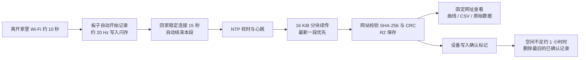
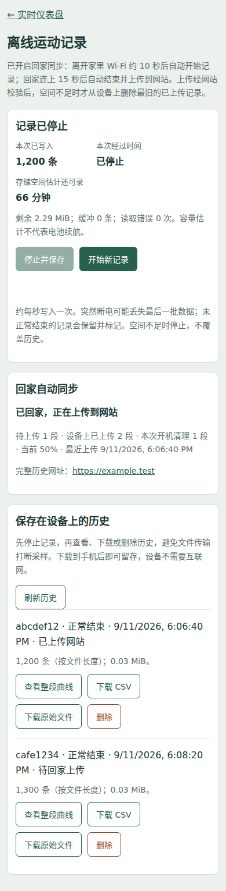

# Delta 项目日报与续接指南 — 2026-09-11

今天完成了**回家自动同步的整条软件链路**：散步时设备自己记录，回家连上家里 Wi-Fi 后自动上传，打开一个固定网址查看完整数据。
私有网站与数据服务已部署，固件已刷写，**实机端到端验证通过**：关闭 Wi-Fi 模拟外出 70 秒的记录，回家后由设备自己结束并上传，网站以相同 SHA-256 确认完整接收。
本日仍不推进佩戴或上狗测试。

## 当前成果

| 事项 | 今日结果 | 证据／入口 |
|---|---|---|
| 目标流程 | 离家自动记录 → 回家自动结束并上传 → 固定网址查看曲线、CSV、原始数据 | [同步说明](2026-09-11_home_wifi_cloud_sync.md) |
| 网站与数据服务 | 已在 ChatGPT Sites 部署（Cloudflare Workers + R2），仅所有者登录可看；分块续传接口，SHA-256／CRC 校验后才发布 | 网址见同步说明；源码在本地 `site/`（独立仓库，未包含在本仓库） |
| 固件自动上传 | 离家约 10 秒开始记录，开机 30 秒宽限，回家稳定 15 秒后自动结束，最新一段优先上传，失败分级重试 | [cloud_sync.cpp](../firmware/imu_raw_stream/src/cloud_sync.cpp) |
| 存储策略（用户确认） | 只删除网站已确认的记录，最旧优先，仅在剩余不足约 1 小时录制时删除 | 同步说明「存储策略」 |
| 设备页面 | `/records` 新增同步面板和网址，每段标注「已上传网站／待回家上传」 | 下方截图 |
| 自动化检查 | 类型检查、主机模拟、原有编解码测试、两项浏览器测试通过 | 见「检查结果」 |
| 实机 | **通过**：模拟外出记录 `e1c527b1`（1,071 条／25,736 字节）自动上传，网站确认 SHA-256 `bdeb8523…`；同轮实测断点续传与自动清理 | `data/raw/cloud_sync_20260911/physical_final/result.json` |
| 实机修复 | 跨 HTTPS 请求保留文件描述符会导致 TLS 之后 `seek` 失败；改为每块重新打开文件定位 | [cloud_sync.cpp](../firmware/imu_raw_stream/src/cloud_sync.cpp) |
| 正式网址 | 确认为 `...yesmora.chatgpt.site`（旧地址在浏览器里会跳转），设备凭据请求返回 200、无跳转 | [同步说明](2026-09-11_home_wifi_cloud_sync.md) |

## 数据链路

外出时不需要手机、路由器或互联网；回家后也不需要连接设备热点或手动上传。设备必须保持开机直到上传完成。
没有配置网站凭据的设备保持原来的「开机即记录、不上传」行为。

## 检查中发现并修订的问题

网站、第一版同步固件和实机脚本来自上一轮会话。本轮逐项检查后修订了固件：

1. **上传后从不删除本地记录**：4 MiB 分区累计约 2 小时后会存满并停止记录。现按用户确认的策略自动清理已确认记录。
2. **每次在家开机都会产生一段几十秒的启动记录**：改为开机先等 30 秒让家里 Wi-Fi 连上。
3. **家里 Wi-Fi 短暂掉线会立即开始新记录**：改为连续断开 10 秒才开始。
4. **外出时手动「停止并保存」后会立刻自动重新开始**，导致无法停下来下载或关机：现在保持停止到下次回家。
5. **网站拒收的记录每约 90 秒重复提交**：改为标记 `.reject`，每次重启只重试一次；凭据错误 5 分钟后重试。
6. **空请求体的 POST 没有 Content-Length，且只信任一个根证书**：现显式发送 0 长度，并加入 GTS Root R1、ISRG Root X1／X2，证书验证保持开启。
7. **存储满时每个循环都尝试开始记录**（每次都遍历文件系统）：改为 30 秒退避。

## 设备页面（模拟数据）

这是浏览器测试中用模拟设备接口生成的截图，**不是真实记录**，只用于检查页面内容和 390 px 手机宽度布局。

## 检查结果

| 检查 | 结果 |
|---|---|
| C++ 类型检查（Arduino 桩头文件，gnu++11／gnu++17，`-Wall -Wextra`） | 无错误、无警告 |
| 主机模拟 `tests/cloud_sync_sim/run.sh` | 通过：只删已确认记录、最旧优先、达到 2.3 MB 即停；未确认和正在记录的文件不删；孤立标记被清理；最新一段优先上传；`.retry` 跳过、`.reject` 计数 |
| 原有编解码测试 `tests/test_offline_log.py` | 5 项通过 |
| 浏览器测试 `tests/records_page_test.cjs` | 通过（未配置同步时页面行为不变） |
| 同步面板 `tests/records_cloud_panel_test.cjs` | 通过，无横向溢出、无页面错误 |
| ESP32 编译与常规刷写（保留数据分区） | 通过，写入校验通过 |
| 实机自动记录→自动结束→自动上传→网站确认 | 通过（`physical_final/result.json`，三次运行日志无 `ERROR`／HTTP 错误） |
| 实机断点续传 | 通过：1.75 MiB 旧记录从第 65,536 字节继续 |
| 实机自动清理 | 通过：删除已确认的 `20cd0468`（6,008 字节） |
| 一小时电池续航、真实出门 | **尚未进行** |

桩头文件只模拟 arduino-esp32 2.0.x 的接口签名，不能替代 PlatformIO 编译；主机模拟不包含 TLS、Wi-Fi 和真实闪存时序。

## 实机实测数据

| 项目 | 实测 |
|---|---|
| 项目 | 首次实机（改动前） | 两次复测（改动后） |
|---|---|---|
| 外出采样 | 15.22 Hz | **19.46 / 19.43 Hz** |
| 未覆盖时间 | 28.5%（61 段间隔／70 秒） | **3.1% / 3.7%**（13 段／79 秒、16 段／76 秒） |
| 最大采样间隔 | 760 ms | 366 / 325 ms |
| 一段外出记录 | 1,071 条 | 1,543 条、1,470 条 |
| 上传请求阻塞 | 中位 4.8 秒、p90 10.3 秒 | 首个（含握手）8.0–9.7 秒，之后约 4.2 秒 |
| 回家自动结束 | 恢复 Wi-Fi 后约 26 秒 | 同上 |
| 电池电压 | 4.202 V（USB 供电，未做续航测试） | — |

三次运行的网站回执都确认了相同的 SHA-256。两次复测之间，板子自己把 10 段共 2.30 MiB 积压全部传完，并按策略删除了已确认的旧记录（含 1.75 MiB 的 `82ce2b54`），复测开始时待上传为 0——存储策略在实机上按预期工作。

## 针对首次实测的两项改动

1. **采样间隙**：定位到每次落盘都会调用一次遍历整个文件系统的剩余空间统计，分区越满越慢（近空盘 133 ms → 半满 317 ms），间隙节奏与每秒落盘一致，与 Wi-Fi 无关。改为缓存估计值（空间充足 30 秒刷新一次，接近保留区 5 秒一次），真实写入失败仍会停止记录并复核。**复测确认采样回到 19.4 Hz。**
2. **上传速度**：改为复用同一个 TLS 连接。**复测显示握手确实省掉了，但每个请求仍约 4.2 秒，且与请求体大小无关**（0 字节的 complete 请求也要 4.6 秒）。随后从同一家庭网络的 Mac 测同一接口：新建连接 1,009 ms、复用连接 879 ms，说明**约 3.3 秒耗在板子这侧**。
3. **上传速度（已解决）**：先怀疑射频省电，实测无效并撤销；加上「每请求耗时 + 是否复用 + 网站的 Connection 回答」日志后，看到 `reused=0` 而网站回的是 `keep-alive`，于是查这版 Arduino 核心的 `HTTPClient` 源码：`end()` 保留 socket 却不清空内部 client 指针，紧接着对象析构无条件 `stop()`，把刚保留的连接关掉了。改成常驻成员后实测**新建连接约 4.0 秒、复用连接 1.01 秒**，与 Mac 的 0.9 秒持平。一小时记录的上传时间由此从约 7.8 分钟降到约 1.9 分钟。

## 网站侧核对

登录网站后逐项确认：共 **17 段、2.50 MB**，包含设备本地已经清理掉的旧记录，说明网站确实是完整历史而设备只留近期。列表接口 409 ms，设备心跳在线。
最大的一段（旧固件遗留，73,119 条、约 71 分钟、1.75 MiB）详情接口 1.53 秒、CSV 导出 1.16 秒共 73,119 行、原始文件下载正常——**一小时散步正是这个量级，之前担心的平台 CPU 限制问题不存在**。
最新一段 1,543 条的网页显示「未覆盖 2.8 秒」，与设备端实测的 3.1% 吻合；旧固件那段是 19.6%，对比明显。
小问题：网站导出的 CSV 用完整浮点精度（会出现 `-0.35000000000000003`），比设备端导出大约大 50%，属于可改进项，需要在 Codex 中改并部署。

## 活动分析（离线，尚未标定）

`experiments/gait_analysis.py` 从一段记录算出：静止／走／跑的时间预算、相对活动指数、步频曲线和图。方法是 4 秒窗口、2 秒步进，特征为合加速度的 MAD（平均振幅偏差，毫 g）、ENMO、陀螺仪幅度，以及 0.5–5 Hz 带内的主频与周期性。20 Hz 采样的奈奎斯特是 10 Hz，足以分辨 1–4 Hz 的步频。

在 20 Hz 下 MAD 比 ENMO 区分度好得多：桌面实测中，手动摆弄板子时 MAD 约 100 mg、静止 0.7 mg，而两者的平均 ENMO 都低于 30 mg。因此分类和活动指数都用 MAD，ENMO 仅作为与人体加速度计文献对照的参考值。

**当前阈值是占位值，没有标定。** 需要一段带标签的数据（`--labels` 加 `--suggest` 会给出分界建议并输出混淆矩阵）。另外：加速度计不能测能量消耗，行业做法是先用间接测热法把活动计数回归到实测能耗上，且随设备与佩戴位置而变；所以这里只给相对活动指数，不给千卡。

## 网站端分析（已写好，待部署）

用户的目标状态是：把盒子绑在胸背上带出门，回来登录网站就能看到数据和分析，中间不碰任何按钮。为此把离线脚本的算法移植成 `site/lib/gait.ts`，在**上传时算一次**并随记录存储（页面详情里也会重算，所以此前已上传的记录同样能看到），页面上新增静止／走路／跑动时长、活动指数，以及按状态着色的曲线底色。移植后用同一批台面数据对拍，TypeScript 与 Python 的时间预算和指数完全一致。

网站只能在 Codex 里部署，所以这部分需要用户先本地 `npx tsc --noEmit && npm run build` 验证，再在 Codex 中部署。

## 限制与风险

- 网站托管在 ChatGPT Sites：修改网站需要在 Codex／ChatGPT 中部署；Claude 会话无法访问或部署该网站。
- 网站的分块接口会检查 `content-length` 请求头；如果托管平台的代理去掉这个头，上传会返回 400。实机验证会暴露这个问题，修复需要改 `site/` 并重新部署。
- 单段最大 4 MiB，网站在一次请求中组装并解码；托管平台 CPU 限制下的大文件表现未实测。
- 外出时设备热点常开并每 15 秒尝试重连，会增加耗电；一小时续航仍未测。
- Sites 访问令牌过期后需要重新授权并写入设备。
- 采样仍受同步闪存写入影响，不是严格恒定 20 Hz；时间戳如实保留间隙。

## 下次从这里继续

1. 登录网站确认 `e1c527b1` 的曲线、CSV 与原始文件下载正常；让板子在家开着，把剩余 2.30 MiB 积压传完后再看一次（应共 10 段）。
2. 实际出门短走一次，回家后确认网站自动出现新记录，这是真正的端到端验收。
3. 真实出门走一次：既是端到端验收，也顺带确认真实体量记录（数百 KB）的上传速度。
4. 一小时电池记录；评估外出时是否关闭热点以省电。
5. 采样已恢复到 19.4 Hz，剩余约 3% 的未覆盖时间来自落盘本身，暂不处理。
6. 如需修改网站，在 Codex 中修改并部署 `site/`。

## 今天归档的文件

| 类别 | 文件 |
|---|---|
| 同步固件 | [cloud_sync.h](../firmware/imu_raw_stream/src/cloud_sync.h)、[cloud_sync.cpp](../firmware/imu_raw_stream/src/cloud_sync.cpp)、[根证书](../firmware/imu_raw_stream/src/cloud_ca.h)、[main.cpp](../firmware/imu_raw_stream/src/main.cpp)、[记录器](../firmware/imu_raw_stream/src/motion_logger.cpp)、[手机页面](../firmware/imu_raw_stream/src/records_page.h) |
| Mac 脚本与实机验证 | [cloud_sync_mac.sh](../experiments/cloud_sync_mac.sh)、[validate_cloud_sync.py](../experiments/validate_cloud_sync.py) |
| 自动化检查 | [主机模拟](../firmware/imu_raw_stream/tests/cloud_sync_sim/)、[同步面板浏览器测试](../firmware/imu_raw_stream/tests/records_cloud_panel_test.cjs) |
| 实机分析工具 | [运行分析](../experiments/analyze_cloud_sync_run.py)、[网站延迟测量](../experiments/measure_cloud_latency.py)、[串口计时探测](../experiments/cloud_self_test.py) |
| 活动分析（离线） | [步态与活动量分析](../experiments/gait_analysis.py) |
| 说明 | [同步说明](2026-09-11_home_wifi_cloud_sync.md)、[固件说明](../firmware/imu_raw_stream/README.md) |

网站凭据和刷写前的整片备份留在本地 `data/raw/cloud_sync_20260911/`，由 `.gitignore` 排除，不可提交或公开。
网站源码 `site/` 是独立的 Sites 仓库，本仓库忽略该目录，因此不在 GitHub 上。
