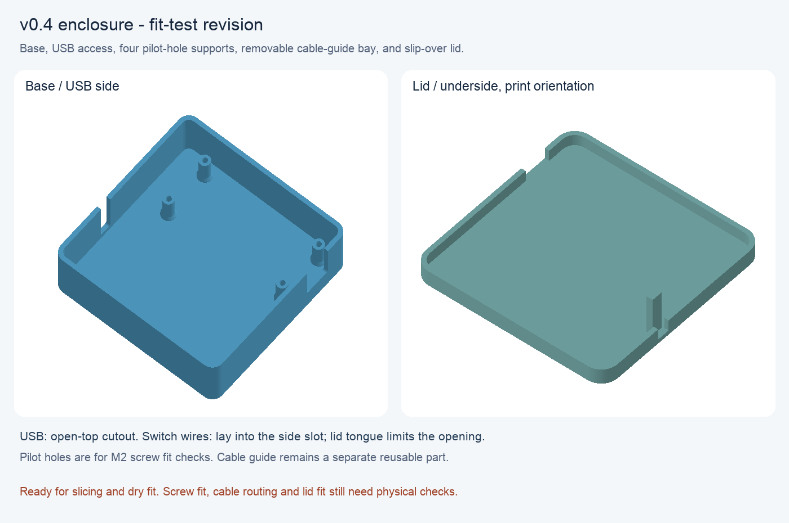
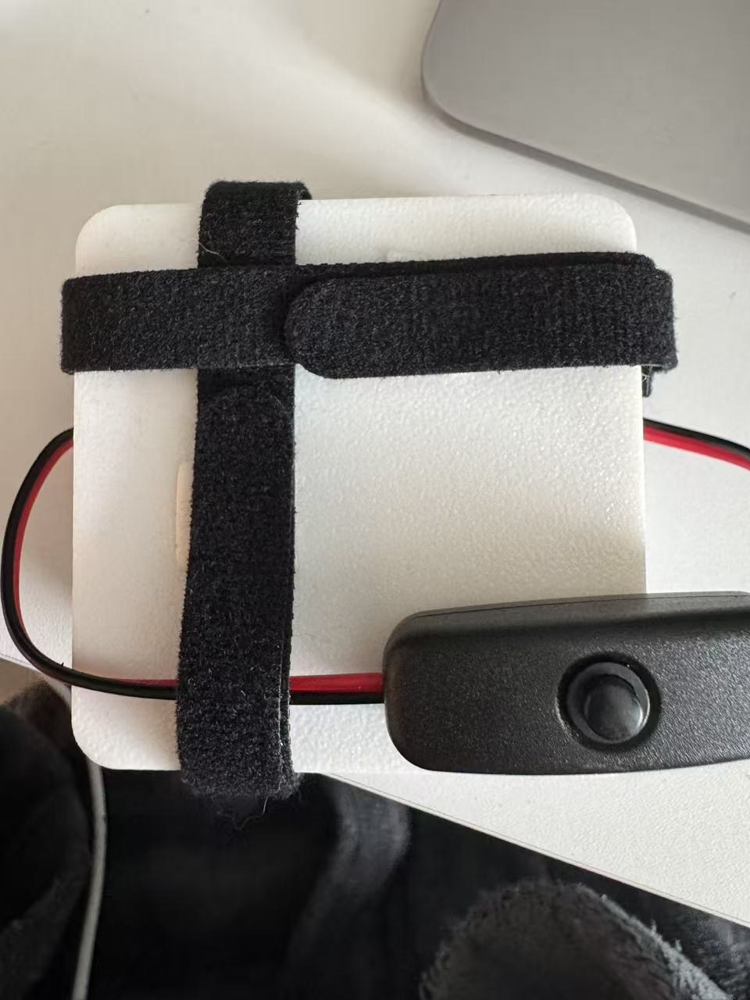
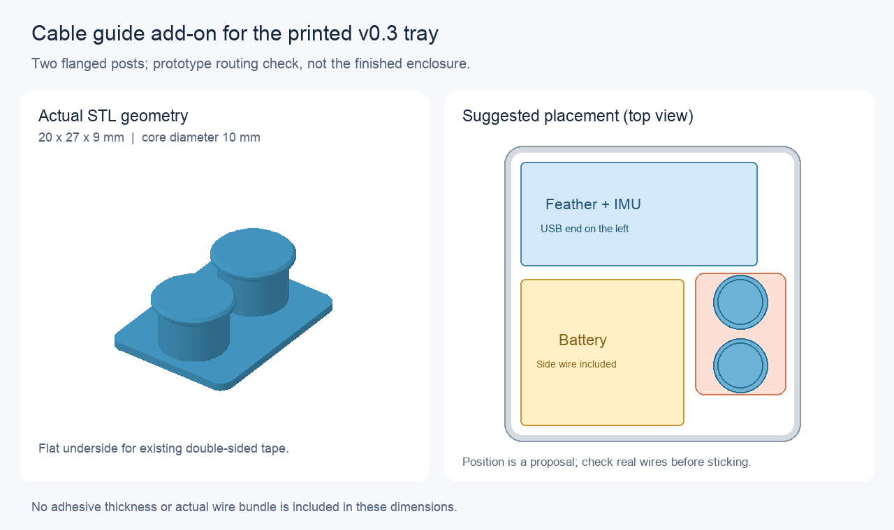

# 小外壳：v0.4 底盒和盖子，沿用 v0.3 理线座

项目续接入口：[9 月 9 日日终报告](../../docs/2026-09-09_daily_report.md)。用户已确认 v0.4 打印和组装完成；当前优先离线记录，暂缓佩戴测试。

2026-09-09 最新：已根据补测完成 [v0.4 带盖试装版](v0_4/README.md)，包含 USB 开口、外置开关线槽与四根 Feather 支撑柱。

- [底盒 STL](v0_4/delta_collar_v0_4_base.stl)：65.25 × 65.25 × 21.36 mm，四柱已经合并在底盒内。
- [盖子 STL](v0_4/delta_collar_v0_4_lid.stl)：69.05 × 69.05 × 15.57 mm，包含向内伸出的线槽挡片，文件已摆成打印朝向。
- 两份都要导入；装配后名义总高 22.96 mm。网格、尺寸及名义碰撞检查通过；用户已完成打印和组装。
- 用户确认 IMU 不遮挡右侧孔；插头金属外壳为 8.95 × 3.30 mm，开关线合计外包络 3.32 × 1.59 mm。
- 柱子带 M2 试配导孔，实际锁固仍需螺钉。盖子松紧与全部线材走向需断电试装。

照片记录整体外观；实际螺钉规格、内部固定和佩戴保持力仍没有单独验证。

## 正在试用的 27 mm 理线座

2026-09-09：用户已打印托盘并确认组件和电池可以并排放下，仍有空余空间；新增需求是整理较长的线材。

当前追加文件：[delta_collar_v0_3_cable_guide_27mm.stl](delta_collar_v0_3_cable_guide_27mm.stl)，尺寸 **20 × 27 × 9 mm**。
用户实测可用长边约 30 mm，已按要求缩至 27 mm；原 32 mm 版本仅作历史记录。
这是独立双柱理线座，可先放入电池旁空位试绕线，再用已有双面胶固定在托盘底面。
完整操作和摆放图见 [9 月 9 日理线记录](../../docs/2026-09-09_stage1b_tray_fit_and_cable_routing.md)。

理线座已检查导出网格和尺寸。用户已确认整体组装完成，但合盖照片没有单独展示内部理线座及其固定效果。其 SCAD 可编辑；生成脚本依赖的库版本记录在对应 validation.json 中。
v0.4 给此配件预留位置，继续用独立理线座，便于复用和调整。

## v0.3 托盘参考

已打印的托盘文件：[delta_collar_enclosure_v0_3_fit_tray.stl](delta_collar_enclosure_v0_3_fit_tray.stl)。
此托盘用于断电检查占地和走线。它只有低侧壁，组件会高于侧壁；不是最终带盖外壳。

## 本版尺寸

| 项目 | 尺寸／状态 |
|---|---|
| 外尺寸 | 65.25 × 65.25 × 11.60 mm |
| 内部平面尺寸 | 62.05 × 62.05 mm（圆角附近空间略减） |
| 内部侧壁高度 | 10.00 mm |
| 底厚／壁厚 | 1.60／1.60 mm |
| Feather＋IMU 高度基准 | 16.36 mm；IMU 嵌在排针间，不重复加高 |
| Feather 含 USB 的参考占地 | 52.05 × 22.80 mm；外接线材另留空间 |
| 电池参考占地 | 35.90 × 32.25 mm，包含沿边电线 |
| 两组件摆放间距 | 3.00 mm，设计初值 |
| 周边留量 | 2.00 mm，设计初值 |
| 板长方向一端线材预留 | 8.00 mm，设计初值，不是已测弯曲半径 |
| 开关 | 外置 |

本版不设置固定柱，便于检查当前 IMU 位置是否挡住 Feather 右侧孔区。
四孔坐标已记录，但柱体直径和支撑通道尚未确定。低侧壁也让未确定出口位置的电线能够从上方绕出。

## 托盘原始试装步骤（并排占地已确认）

1. 拔掉 USB，保持电池与电路断开，保留当前卡住的 Feather＋IMU 组合，不为试装强拆。
2. 在 Bambu Studio 新建项目，导入上面的 STL。单位按 mm、缩放保持 100%，核对外尺寸为 65.25 × 65.25 × 11.60 mm。平底朝打印板、开口朝上，沿用已验证的打印机／材料配置。托盘几何不需要支撑；先切片检查有完整底面和开放顶部，再自行开始打印。
3. 冷却并清理毛刺后，轻放组件。Feather 的长边与托盘一边平行，电池放在它旁边，电池 35.90 mm 长边与 Feather 长边同向。开关留在盒外；不要叠压电池或用力把组件压向底面。
4. 检查：电池能平放取出；两组件和线材互不挤压；接头能插拔；四个 Feather 孔周围是否有放支撑柱的空间。元件高出低侧壁是预期效果，现阶段不尝试合盖或通电。
5. 把组合、电池和线材摆好，提供一张俯视照片和一张侧面照片，并指出碰到侧壁或走线太紧的位置。下一版据此确定柱位、完整盒高、出线口和盖子。

若目前已有打印好的旧托盘，可以先做同样的断电摆放，反馈卡住的位置；旧模型的电池宽度为 29 mm，与实测 32.25 mm 不符，不能据其尺寸认定新布局能放下。

## 文件与核对

- [SCAD 模型](delta_collar_enclosure_v0_3_fit_tray.scad)：含预览用组件包络，包络不导出到 STL。
- [生成脚本](generate_v0_3_fit_tray.py)：仅依赖 Python 标准库，修改脚本中的实测尺寸／设计留量并运行，可同步再生成 SCAD 和 STL。
- [网格检查结果](delta_collar_enclosure_v0_3_fit_tray_validation.json)：读取导出的二进制 STL 检查了外尺寸、544 个三角面、单个连通实体、每边恰好两个相邻面、朝向及体积。实体表面闭合，托盘顶部仍是开口；两者不是同一概念。

托盘导出时未运行 OpenSCAD 渲染或 Bambu 切片检查，也未由助手发起打印；用户后续已完成打印及并排摆放。导出使用与 SCAD 一致的轮廓直接生成网格。
旧 `delta_collar_enclosure_v1.scad` 及 v0.1／v1／v1_1 STL 保留为历史起点；当前带盖试装使用 v0.4 底盒和盖子，理线座使用带 `27mm` 后缀的 v0.3 文件。
