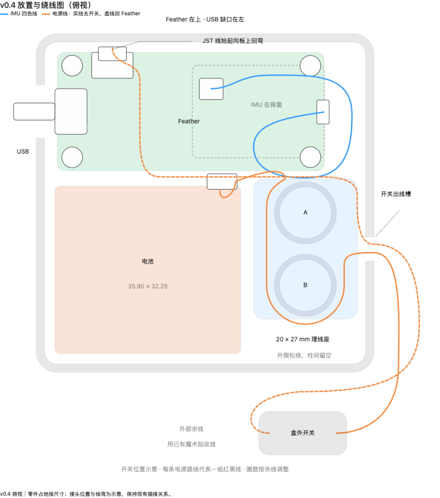

# v0.4：带 USB 开口、出线槽、四柱和独立盖子的试装版

2026-09-09。沿用已经通过实物并排试放的底盒平面尺寸，增加完整高度、Feather 支撑柱和盖子。
用户现已确认打印、组装完成，照片可见魔术贴保持盖子与外置开关；见 [今日报告](../../../docs/2026-09-09_daily_report.md)。
下文保留参数、打印与复装参考。具体螺钉规格、内部保持力及佩戴配合没有被这张合盖照片单独验证。


## 打印文件

可直接下载 [v0.4 试装打印包](../print_packages/delta_collar_v0_4_fit_print_20260909.zip)：包含下列两份 STL、可选的 27 mm 理线座、摆放图和简明说明。打包时已核对 STL 尺寸与压缩包内文件哈希。

| 零件 | 文件 | 导入后尺寸 X × Y × Z（mm） | 朝向 |
|---|---|---|---|
| 底盒，含四根柱子 | [delta_collar_v0_4_base.stl](delta_collar_v0_4_base.stl) | 65.25 × 65.25 × 21.36 | 平底贴板、开口向上 |
| 盖子，含出线挡片 | [delta_collar_v0_4_lid.stl](delta_collar_v0_4_lid.stl) | 69.05 × 69.05 × 15.57 | 外侧大平面贴板，盖内侧及挡片向上；文件已翻好 |

两份都要导入，作为两个独立物体排列，缩放保持 100%。不要把盖子重新翻成盖住底盒的方向打印。
盖子主体只有 5.6 mm 高，STL 的 15.57 mm 高度包括向盒内伸出的出线挡片。装好后的总外尺寸为 **69.05 × 69.05 × 22.96 mm**。

沿用已验证的打印机、材料和参数。按给定方向，几何没有要求额外支撑的封闭悬空顶面；仍先检查切片预览，确认四根柱子、柱内导孔和盖上挡片完整。助手未启动打印。

## 本次收到的补测

- 实际 USB 线插头外壳：**8.95 × 3.30 mm**。用户澄清外壳为金属，原先关于“塑料头高度一致”的描述不作为另一个尺寸。
- 当前 IMU 不遮挡 Feather 右侧两个孔，用户确认下方可放支撑柱。
- 白色电池插头插好后，硬塑料超出 Feather PCB 长边 **1.06 mm**，不含软线。当前位置板边至内壁 2.00 mm，因此硬插头名义平面间隙约 **0.94 mm**；此数值不能作为软线弯曲空间。
- 开关线合并的自然外包络：**3.32 × 1.59 mm**，按本次询问的合计宽、厚记录。槽内需容纳的全部线应一起试放。
- 组合高度继续采用 **16.36 mm**，不再次叠加 IMU 厚度，也不要求拆出 IMU 加胶。

## 结构和装配

**Feather 四柱。** 柱顶距盒内底面 10.10 mm，对应 9.10 mm 下排针突出量加 1.00 mm 离底间隙。柱身直径 4.00 mm，底部加宽到 5.20 mm。四孔位置采用用户孔内缘测量所推导的坐标，仍需实物对孔。柱内为直径 1.60 mm、深 6.00 mm 的 M2 试配导孔，入口带扩口；柱子负责支撑，配合适的螺钉后才形成锁固。

现有采购记录没有确认 M2 螺钉。没有螺钉也能先轻放板组检查四孔和高度，不能把这一步当作板子已固定。螺钉长度取决于实际穿板厚度，伸入柱内应短于 6 mm；导孔是否适合所用螺钉还需试配，不是预制金属 M2 螺纹。

**USB 充电/数据开口。** 位于 Feather USB 一侧，净宽 **10.15 mm**，即插头宽度每侧加 0.60 mm。开口从距内底面 6.00 mm 处一直开到上缘，合盖后最高净空 13.36 mm；底角圆角处宽度略减。较大的垂直窗口用于容纳尚未直接测量的接口中心高度，实际插入时核对外壳及线根不碰盒壁。盖裙同步避让，合盖后可插拔 USB。接口沿板宽居中的位置参考 [Adafruit 官方 PCB 文件](https://github.com/adafruit/Adafruit-ESP32-Feather-V2-PCB)，板长、板宽与四孔位置继续以用户实测为准。

**外置开关出线口。** 位于理线座一侧的盒壁，槽宽 **4.52 mm**，底部圆角半径 1 mm。合盖后开口最大高度 **3.39 mm**，在圆角以上已核对 3.32 × 1.59 mm 的矩形线束可通过。开盖时直接把线放入 U 形槽，再盖上盖子，免去把既有插头穿过小孔。挡片厚 2.20 mm，进入槽内但不夹紧线束；它限位，不代替外部防拉扯固定。

**盖子。** 外套式盖裙，单侧设计间隙 0.30 mm、重叠高度 4.00 mm，顶厚 1.60 mm。当前是台架试装配合盖，没有锁扣；实际松紧取决于打印结果。使用现有魔术贴可作临时整盒保持，后续再结合外部开关及项圈固定一起验证。不要靠挤线来让盖子落到底。

**27 mm 理线座。** 继续使用 [20 × 27 × 9 mm 独立配件](../delta_collar_v0_3_cable_guide_27mm.stl)，本版留位，不重复打印或合并到盒底。相对底盒外角的建议左下/起始坐标仍为 X=42、Y=28 mm；电池起点为 X=3.6、Y=29.4 mm。坐标方向见下文装配预览：USB 在 X 最小的一侧，Feather 和电池沿 Y 并排。模型已检查理线座实体不碰挡片；粘胶厚度、绕线后的高度及余线回弹还需要实际试放。

## 复打／复装参考步骤



可下载 [交互图 HTML](placement_routing.html) 后用浏览器打开，分别切换 IMU 线和开关电源线。[可编辑图源](placement_routing.fragment.html)已随仓库归档。图是本版参数的快照，修改 CAD 布局后应同步更新图中的尺寸与路线。

摆放图的零件占地来自本版参数；插接点、接头形状和软线走向为示意，不是按线长或最小弯曲半径完成的仿真。每条橙色路线代表一组红黑线：实线从电池经外侧绕柱到外置开关，虚线由开关回到 Feather；蓝色代表整条 IMU 四色线。保持现有插接关系，不改接线。

先只摆组件，再放 IMU 松弯，最后沿两柱外侧整理电源余线。IMU 线不强行绕完整一圈，也不穿过两柱挡边之间的窄缝。Feather 电池插头处的线向上抬起后回弯到板上方，不向 0.94 mm 的边缝塞线；这段和 IMU 松弯都需检查合盖高度。图中接头可在邻近可用空间微调，不能压在电池下或用盖子压住。

1. 等当前理线座完成，先试放和松绕线，记录是否有线圈超出底座占地。
2. 导入本版底盒和盖子，核对上表尺寸与朝向，再切片打印。
3. 断开 USB 和电池后，板组轻放到四柱上，检查每个孔都对准、板子平稳、排针不顶底；不要为对孔强拆 IMU。
4. 电池平放到旁边，理线座放入预留空位；把所有要通往开关的线一起放进槽内，开关保持外置。
5. USB 线电脑端断开时试插拔板端；再轻合盖，检查挡片没有夹线、盖沿能够落到底。反馈顶视图和侧视图及任何碰撞点，再调整间隙和完成固定。

用户已确认整体组装，后续也完成了 USB 离线记录短测。板组锁固、电池保持、外置开关及线材防拉扯的具体细节与佩戴保持力仍需单独记录；USB 短测不等同于完整机械或续航验证。

## 参数与检查

- [design_inputs.json](design_inputs.json)：实测值与设计留量分开记录。未知实测值为 null 时，正常导出会拒绝，`--draft` 仅输出带后缀的评审草稿。
- [generate_enclosure.py](generate_enclosure.py)：参数化实体生成、STL 重新读入验证和实际网格预览。Python 依赖见 [requirements.txt](../requirements.txt)，验证时使用 Python 3.12.3。绘图字体当前使用 macOS 系统 Arial，换系统时需修改字体路径。
- [assembly.scad](assembly.scad)：装配查看器，导入生成的 STL 和组件包络；`show_lid=true` 查看盖合位置。尺寸编辑入口是 JSON，不是这个查看器。
- [validation.json](validation.json)：底盒 4,028 面、盖子 602 面；各为单个闭合实体，朝向一致、无退化面、外尺寸正确。名义合盖状态无底盒/盖子体积干涉，USB 与线束通道探针通过，电池及理线座的名义包络无干涉。

生成命令：

```sh
python hardware/enclosure/v0_4/generate_enclosure.py
```

网格和名义包络检查不能替代实际打印公差、焊点/接插件占位、螺钉试配与最终线材布局检查。
